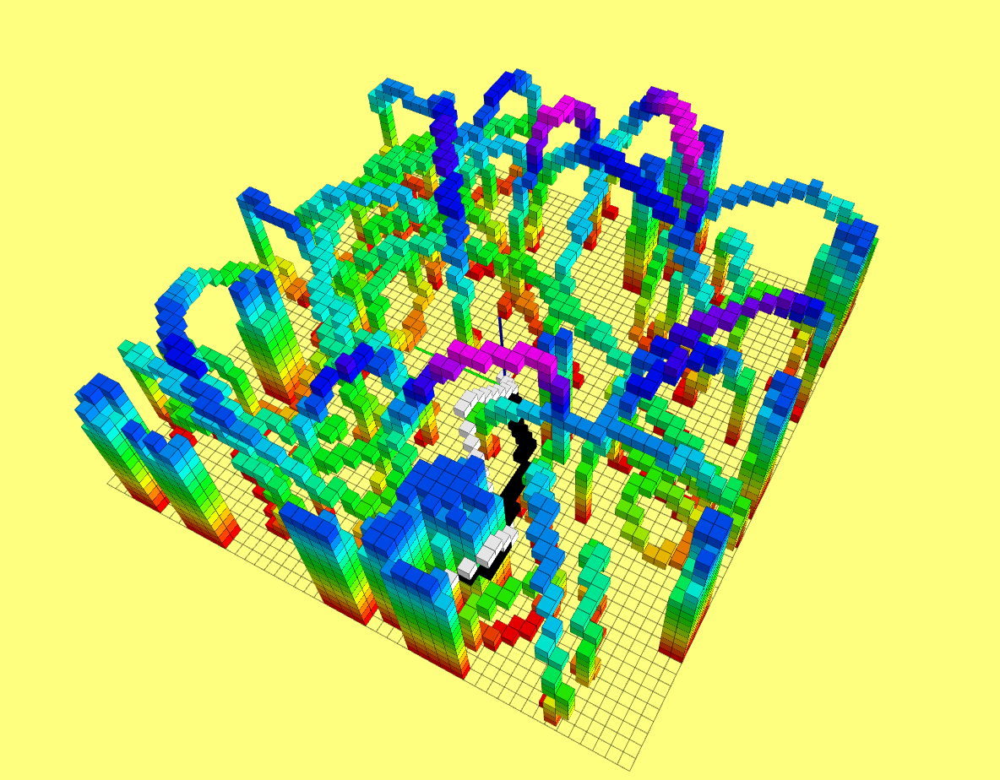

# Astar-JPS-Algorithm-ROS
 An cpp implementation of 3D A* and JPS algorithm demo for ROS，more details can be found at 
 https://mesywang.github.io/2020/01/23/Dijkstra-and-Astar/

## 1. Prerequisites
+ Ubuntu 64-bit 16.04. [ROS Kinetic](http://wiki.ros.org/kinetic/Installation/Ubuntu).
+ Eigen

## 2.Build on ROS
+ Clone this repository to your catkin workspace and catkin_make.
```
  cd ${YOUR_WORKSPACE_PATH}/src
  git clone https://github.com/Mesywang/Astar-JPS-Algorithm-ROS.git
  cd ../
  catkin_make
```
## 3. Run the Demo

+ Run the rviz with specified configuration.
the path of configuration file：~/catkin_ws/src/grid_path_searcher/launch/rviz_config/demo.rviz 

+ Launch the package.
```
roslaunch grid_path_searcher demo.launch   
```
　　Normally, you will find a  complex randomly generated map in Rviz. The sparsity of obstacles in this map can be tuned in demo.launch. At this time, you can select a goal for the A* or JPS algorithm by using the 3D Nav Goal tool.

+ The result

　　You will find two paths. The path formed by  black cubes is calculated by the A * algorithm，and another path formed by  white cubes is calculated by the JPS. They are different，but they're both optimal.
<div align=center>
	
</div>
